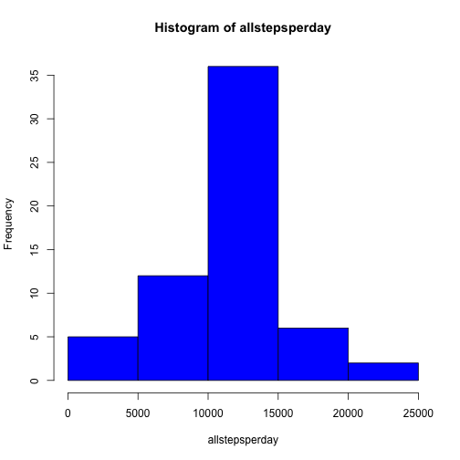

# Reproducible Research: Peer Assessment 1


## Loading and preprocessing the data

We retrieve the data available in the file "activity.csv". All columns are by default considered as Strings. The first and third columns are set to numeric type.


```r
activity <- read.csv("activity.csv",colClasses = c("numeric","Date","character"))
summary(activity)
```

```
##      steps            date              interval        
##  Min.   :  0.0   Min.   :2012-10-01   Length:17568      
##  1st Qu.:  0.0   1st Qu.:2012-10-16   Class :character  
##  Median :  0.0   Median :2012-10-31   Mode  :character  
##  Mean   : 37.4   Mean   :2012-10-31                     
##  3rd Qu.: 12.0   3rd Qu.:2012-11-15                     
##  Max.   :806.0   Max.   :2012-11-30                     
##  NA's   :2304
```

## What is mean total number of steps taken per day?

We first retrieve different dates occurring in the file.

```r
dates <- unique(activity$date)
```

We need to sum up all steps per day.

```r
allstepsperday <- numeric()
for (adate in dates) {
  allstepsperday <- c(allstepsperday,sum(activity[activity$date==adate,]$steps))
}
hist(allstepsperday,col="GREEN")
```

 

Finally, we compute the mean and median, ignoring the days for which no data is available.

```r
themean <- mean(allstepsperday,na.rm=TRUE)
```

```r
themedian <- median(allstepsperday,na.rm=TRUE)
```

The mean of the total number of steps per day is 1.0766 &times; 10<sup>4</sup>. It's median is 1.0765 &times; 10<sup>4</sup>.

## What is the average daily activity pattern?

We first retrieve all the intervals (x-axis).

```r
intervals <- unique(activity$interval)
```

Then we average the values across all days.

```r
averageperinterval <- numeric()
for (interval in intervals) {
  averageperinterval <- c(averageperinterval,mean(activity[activity$interval==interval,]$steps,na.rm=TRUE))
}
```

We plot the information.

```r
plot(x = intervals, y=averageperinterval,type="l",col="GREEN")
```

 


```r
maxvalue <- max(averageperinterval)
maxindex <- match(maxvalue,averageperinterval)
maxinterval <- intervals[maxindex]
```

The max value is 206.1698 in the interval 835.

## Imputing missing values

### Total number of missing values

To count the total number of missing values, we count the number of true in the vector returned by is.na().

```r
nbmissingvalues <- sum(is.na(activity$steps))
```

The number of total missing values is 2304.

We can check that we obtain the same value using summary.

```r
summary(activity)
```

```
##      steps            date              interval        
##  Min.   :  0.0   Min.   :2012-10-01   Length:17568      
##  1st Qu.:  0.0   1st Qu.:2012-10-16   Class :character  
##  Median :  0.0   Median :2012-10-31   Mode  :character  
##  Mean   : 37.4   Mean   :2012-10-31                     
##  3rd Qu.: 12.0   3rd Qu.:2012-11-15                     
##  Max.   :806.0   Max.   :2012-11-30                     
##  NA's   :2304
```

### Strategy to fill in missing values

We are going to use the interval average to fill in missing values. To make it more realistic, we will use only the integral part, not the decimal part (using the function floor()).

### Creating a new dataset

Here were create the new steps column. 

```r
fillinNA <- function(row) if (is.na(row[1])) floor(averageperinterval[match(row[3],intervals)]) else row[1]
nactivity <- as.numeric(apply(activity,1,fillinNA))
length(nactivity)
```

```
## [1] 17568
```

```r
summary(nactivity)
```

```
##    Min. 1st Qu.  Median    Mean 3rd Qu.    Max. 
##     0.0     0.0     0.0    37.3    27.0   806.0
```

We perform some checks to see if everything is fine in the new step column.
We first check that the number of 0's in the final dataset is greater or equal to the original one.

```r
zeros <- activity$steps[activity$steps==0]
length(zeros) - nbmissingvalues
```

```
## [1] 11014
```

```r
nzeros <- nactivity[nactivity==0]
length(nzeros)
```

```
## [1] 11446
```

We check there there is no longer any NA in the column.

```r
nbnainnewcolumn <- sum(is.na(nactivity))
nbnainnewcolumn
```

```
## [1] 0
```

Everything looks fine, so updating dataset.

```r
activity$steps <- nactivity
```

### new statistics

We reuse the code of part one to draw the histogram and compute the mean and median values.


```r
allstepsperday <- numeric()
for (adate in dates) {
  allstepsperday <- c(allstepsperday,sum(activity[activity$date==adate,]$steps))
}
hist(allstepsperday,col="BLUE")
```

 

Finally, we compute the mean and median, ignoring the days for which no data is available.

```r
thenewmean <- mean(allstepsperday,na.rm=TRUE)
```

```r
thenewmedian <- median(allstepsperday,na.rm=TRUE)
```

The mean of the total number of steps per day is 1.075 &times; 10<sup>4</sup> (was 1.0766 &times; 10<sup>4</sup>). It's median is 1.0641 &times; 10<sup>4</sup> (was 1.0765 &times; 10<sup>4</sup>).

## Are there differences in activity patterns between weekdays and weekends?

### Add weekday/weekend information
Here we create a new column by tagging each row by "weekend" or "weekday".
Note that the current implementation is locale dependent (here it works in French).
We create a new column named "when" in the dataset.

```r
weekdays <- weekdays(activity$date)
labeler <- function(x) if (x == "Samedi" || x == "Dimanche") "weekend" else "weekday"
newcol <- sapply(weekdays,labeler)
activity[,"when"] <- newcol
summary(activity)
```

```
##      steps            date              interval        
##  Min.   :  0.0   Min.   :2012-10-01   Length:17568      
##  1st Qu.:  0.0   1st Qu.:2012-10-16   Class :character  
##  Median :  0.0   Median :2012-10-31   Mode  :character  
##  Mean   : 37.3   Mean   :2012-10-31                     
##  3rd Qu.: 27.0   3rd Qu.:2012-11-15                     
##  Max.   :806.0   Max.   :2012-11-30                     
##      when          
##  Length:17568      
##  Class :character  
##  Mode  :character  
##                    
##                    
## 
```

### Histogram of the weekday/weekend activity
We compute separately the average per intervall across all weekdays and weekends. 

```r
averageperintervalweekday <- numeric()
for (interval in intervals) {
  averageperintervalweekday <- c(averageperintervalweekday,mean(activity[activity$interval==interval&activity$when=="weekday",]$steps,na.rm=TRUE))
}
averageperintervalweekend <- numeric()
for (interval in intervals) {
  averageperintervalweekend <- c(averageperintervalweekend,mean(activity[activity$interval==interval&activity$when=="weekend",]$steps,na.rm=TRUE))
}
```
We plot our information using R default plotting system.

```r
par(mfrow=c(2,1))
plot(x = intervals, y=averageperintervalweekend,type="l",col="BLUE",main="weekend",xlab="Interval",ylab="Number of steps")
plot(x = intervals, y=averageperintervalweekday,type="l",col="BLUE",main="weekday",xlab="Interval",ylab="Number of steps")
```

 
